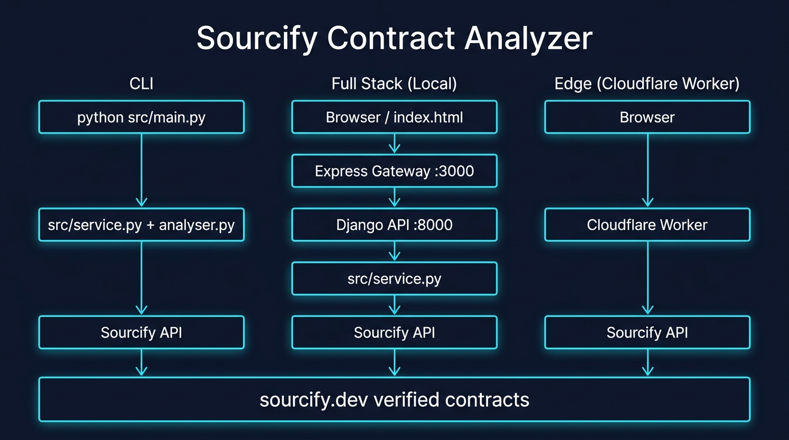

# sourcify-contract-training-data

Python tooling to collect and analyze verified smart-contract data from [Sourcify](https://sourcify.dev/), now with a minimal full-stack demo and a Cloudflare Worker deployment target.



## Architecture

```text
Frontend page (frontend/public/index.html)
        ↓
Express gateway (frontend/server.js)
        ↓
Django API (backend/api/views.py)
        ↓
Python analysis service (src/service.py + src/analyser.py)
        ↓
Sourcify API
```

### Alternative: Cloudflare Worker (edge deployment)

```text
Browser
  ↓
Cloudflare Worker (cloudflare-worker/src/index.js)
  ↓
Sourcify API
```

The Worker replaces the Express + Django stack for a zero-infra, single-file edge deployment.
It is the recommended demo path for hackathon judges who want a live URL.

## Repo layout

```text
backend/           Django project + API endpoints
frontend/          Express server + static frontend page
cloudflare-worker/ Edge demo: Worker serves HTML + analysis API without Django or Express
src/               Core Python analysis logic (used by both Django and the CLI)
```

## Requirements

- Python 3.10+
- Node.js 18+
- `pip`
- `npm` / `npx`

## Option A: Cloudflare Worker (recommended for demos)

```bash
cd cloudflare-worker
npm install
npx wrangler login   # opens browser to authenticate your Cloudflare account
npx wrangler deploy
```

Wrangler will print a live URL like `https://sourcify-worker-demo.<account>.workers.dev`.

> 🔗 **Live demo:** *(paste your Workers URL here after deploy)*

## Option B: Local full-stack (Django + Express)

### Backend (Django)

```bash
python3 -m pip install --upgrade pip
python3 -m pip install -r requirements.txt

export DJANGO_SECRET_KEY="your-secret-key"   # required in non-dev envs
export DJANGO_ENV=development                 # use 'production' for hardened mode
export INTERNAL_GATEWAY_SECRET="shared-secret"  # optional, secures Express↔Django

python3 backend/manage.py migrate
python3 backend/manage.py runserver 127.0.0.1:8000
```

#### Backend endpoints

- `GET  /api/health/`
- `POST /api/contracts/analyze/`

Sample request:

```json
{
  "chainId": 1,
  "address": "0x4e68Ccd3E89f51C3074ca5072bbAC773960dFa36"
}
```

### Frontend (Express gateway + static page)

```bash
cd frontend
npm install
INTERNAL_GATEWAY_SECRET="shared-secret" npm start
```

Express runs on `http://127.0.0.1:3000` and proxies API traffic to the Django backend.

To override the backend URL:

```bash
DJANGO_BASE_URL=http://127.0.0.1:8000 npm start
```

## Option C: CLI (original Python script)

```bash
python3 src/main.py
```

## Security notes

| Concern | How it's addressed |
|---|---|
| Django `SECRET_KEY` | Read from `DJANGO_SECRET_KEY` env-var; fallback is dev-only |
| `DEBUG` mode | Defaults to `True` only when `DJANGO_ENV=development`; set to `production` before exposing publicly |
| Express↔Django trust | Optional `INTERNAL_GATEWAY_SECRET` shared header; skip for local dev |
| CSRF | Express frontend calls the Express API (same origin); Django is only called by Express; `@csrf_exempt` is safe in this topology |
| Worker XSS | All values from Sourcify are HTML-escaped via DOM `textContent` before insertion |
